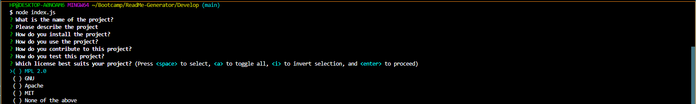

# ReadMe-Generator

## Description
The motivation behind this project was to familiarize myself with node.js and its potential. I built it to challenge myself and prove to myself that I am capable. It generates an automatic ReadMe for projects so there's no added stress to each project. I learned a little about backend programming and how exactly node.js can be incporporated.

## Table of Contents

- [Installation](#installation)
- [Usage](#usage)
- [Credits](#credits)
- [License](#license)

## Installation

run 'node index.js' in the integrated terminal.

## Usage
Answer the questions when prompted and press 'enter' to input each answer.

## Credits

Challenge provided by University of Texas at Austin.

## License

MIT License
